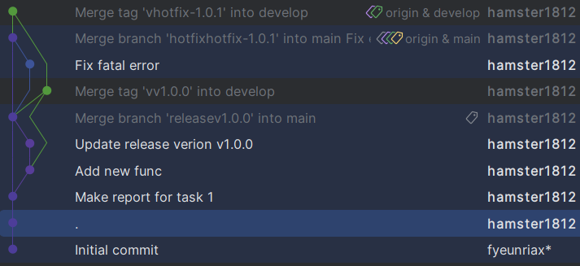

# Отчёт по лабораторной работе №5

### Задача №1

Находим информацию, что при попытке коммита автоматически запускается 
файл .git/hooks/pre-commit, так что именно в него и запишем скрипт.

Задаём тип bash и переменную для проверки на наличие ошибок:

```bash
#!/bin/bash

error_found=false
```

Дальше проходим по всем файлам формата .txt, готовым к коммиту, проверяя файл на пустоту. 
Если файл пустой, то меняем переменную наличия ошибок на true.

```bash
for file in $(git diff --cached --name-only --diff-filter=ACDMRT | grep '\.txt$'); do
    echo "Проверяем $file"
    if [ ! -s "$file" ]; then
        echo "Ошибка: файл $file пустой"
        error_found=true
    fi
done
```

В конце, если есть ошибки, то завершаем с кодом 1, иначе с кодом 0.

```bash
if $error_found; then
    echo "Проверка не пройдена. Коммит отменен."
    exit 1
fi

exit 0
```

### Задача 2

Запускаем Git Flow

```bash
fenix@DESKTOP-FENIX:~/PycharmProjects/Informatic-Lab-5$ git flow init

Which branch should be used for bringing forth production releases?
   - main
Branch name for production releases: [main] main
Branch name for "next release" development: [develop] develop

How to name your supporting branch prefixes?
Feature branches? [feature/] feature 
Bugfix branches? [bugfix/] bugfix
Release branches? [release/] release
Hotfix branches? [hotfix/] hotfix
Support branches? [support/] support
Version tag prefix? [] v
Hooks and filters directory? [/home/fenix/PycharmProjects/Informatic-Lab-5/.git/hooks]
```

Запускаем новую задачу

```bash
fenix@DESKTOP-FENIX:~/PycharmProjects/Informatic-Lab-5$ git flow feature start task-management
Switched to a new branch 'featuretask-management'

Summary of actions:
- A new branch 'featuretask-management' was created, based on 'develop'
- You are now on branch 'featuretask-management'

Now, start committing on your feature. When done, use:

     git flow feature finish task-management
```

Вносим изменения по задаче

```bash
fenix@DESKTOP-FENIX:~/PycharmProjects/Informatic-Lab-5$ echo "def task1():\n    pass" > task_mamager.py
fenix@DESKTOP-FENIX:~/PycharmProjects/Informatic-Lab-5$ git add task_mamager.py 
warning: LF will be replaced by CRLF in task_mamager.py.
The file will have its original line endings in your working directory
fenix@DESKTOP-FENIX:~/PycharmProjects/Informatic-Lab-5$ git commit -m "Add new func"
[featuretask-management d139520] Add new func
 1 file changed, 1 insertion(+)
 create mode 100644 task_mamager.py
```

Завершаем разработку этой задачи

```bash
fenix@DESKTOP-FENIX:~/PycharmProjects/Informatic-Lab-5$ git flow feature finish task-management
Switched to branch 'develop'
Updating 2cd86e3..d139520
Fast-forward
 task_mamager.py | 1 +
 1 file changed, 1 insertion(+)
 create mode 100644 task_mamager.py
Deleted branch featuretask-management (was d139520).

Summary of actions:
- The feature branch 'featuretask-management' was merged into 'develop'
- Feature branch 'featuretask-management' has been locally deleted
- You are now on branch 'develop'
```

Переходим в develop и создаём ветку релиза

```bash
fenix@DESKTOP-FENIX:~/PycharmProjects/Informatic-Lab-5$ git checkout develop
Already on 'develop'
fenix@DESKTOP-FENIX:~/PycharmProjects/Informatic-Lab-5$ git flow release start v1.0.0
Switched to a new branch 'releasev1.0.0'

Summary of actions:
- A new branch 'releasev1.0.0' was created, based on 'develop'
- You are now on branch 'releasev1.0.0'

Follow-up actions:
- Bump the version number now!
- Start committing last-minute fixes in preparing your release
- When done, run:

     git flow release finish 'v1.0.0'
```

Вносим небольшие изменения, так как, например, изменение версии

```bash
fenix@DESKTOP-FENIX:~/PycharmProjects/Informatic-Lab-5$ echo "v1.0.0" > version.txt
fenix@DESKTOP-FENIX:~/PycharmProjects/Informatic-Lab-5$ git add version.txt 
warning: LF will be replaced by CRLF in version.txt.
The file will have its original line endings in your working directory
fenix@DESKTOP-FENIX:~/PycharmProjects/Informatic-Lab-5$ git commit -m "Update release verion v1.0.0"
Проверяем version.txt
[releasev1.0.0 1f7f2ad] Update release verion v1.0.0
 1 file changed, 1 insertion(+)
 create mode 100644 version.txt
```

Завершаем ветку релиза, сливая её в main и develop

```bash
fenix@DESKTOP-FENIX:~/PycharmProjects/Informatic-Lab-5$ git flow release finish v1.0.0
Branches 'main' and 'origin/main' have diverged.
And local branch 'main' is ahead of 'origin/main'.
Already on 'main'
Your branch is ahead of 'origin/main' by 5 commits.
  (use "git push" to publish your local commits)
Switched to branch 'develop'
Merge made by the 'recursive' strategy.
 version.txt | 1 +
 1 file changed, 1 insertion(+)
 create mode 100644 version.txt
Deleted branch releasev1.0.0 (was 1f7f2ad).

Summary of actions:
- Release branch 'releasev1.0.0' has been merged into 'main'
- The release was tagged 'vv1.0.0'
- Release tag 'vv1.0.0' has been back-merged into 'develop'
- Release branch 'releasev1.0.0' has been locally deleted
- You are now on branch 'develop'
```

Создаём ветку для исправления ошибок

```bash
fenix@DESKTOP-FENIX:~/PycharmProjects/Informatic-Lab-5$ git flow hotfix start hotfix-1.0.1
Branches 'main' and 'origin/main' have diverged.
And local branch 'main' is ahead of 'origin/main'.
Switched to a new branch 'hotfixhotfix-1.0.1'

Summary of actions:
- A new branch 'hotfixhotfix-1.0.1' was created, based on 'main'
- You are now on branch 'hotfixhotfix-1.0.1'

Follow-up actions:
- Start committing your hot fixes
- Bump the version number now!
- When done, run:

     git flow hotfix finish 'hotfix-1.0.1'
```

Исправляем ошибки

```bash
fenix@DESKTOP-FENIX:~/PycharmProjects/Informatic-Lab-5$ echo "\n\ntask1()" > task_mamager.py 
fenix@DESKTOP-FENIX:~/PycharmProjects/Informatic-Lab-5$ git add tas
fatal: pathspec 'tas' did not match any files
fenix@DESKTOP-FENIX:~/PycharmProjects/Informatic-Lab-5$ git add task_mamager.py 
warning: LF will be replaced by CRLF in task_mamager.py.
The file will have its original line endings in your working directory
fenix@DESKTOP-FENIX:~/PycharmProjects/Informatic-Lab-5$ git commit -m "Fix fatal error"
[hotfixhotfix-1.0.1 319fcfa] Fix fatal error
 1 file changed, 1 insertion(+), 1 deletion(-)
```

Завершаем эту ветку, сливая изменения в main и develop

```bash
fenix@DESKTOP-FENIX:~/PycharmProjects/Informatic-Lab-5$ git flow hotfix finish hotfix-1.0.1
Branches 'main' and 'origin/main' have diverged.
And local branch 'main' is ahead of 'origin/main'.
Switched to branch 'develop'
Merge made by the 'recursive' strategy.
 task_mamager.py | 2 +-
 1 file changed, 1 insertion(+), 1 deletion(-)
Deleted branch hotfixhotfix-1.0.1 (was 319fcfa).

Summary of actions:
- Hotfix branch 'hotfixhotfix-1.0.1' has been merged into 'main'
- The hotfix was tagged 'vhotfix-1.0.1'
- Hotfix tag 'vhotfix-1.0.1' has been back-merged into 'develop'
- Hotfix branch 'hotfixhotfix-1.0.1' has been locally deleted
- You are now on branch 'develop'
```

Дальше надо было отослать изменения, но у меня возникли некоторые трудности со входом в аккаунт
GitHub через терминал, так что ветки develop и main я отослал через функционал PyCharm.

В итоге, получим вот такое дерево разработки:

